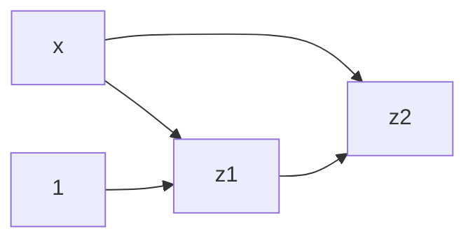
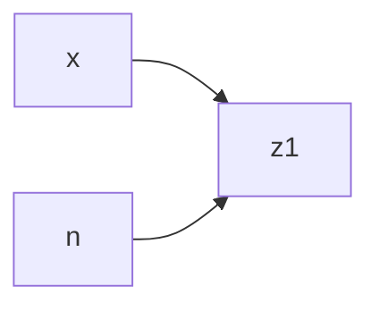
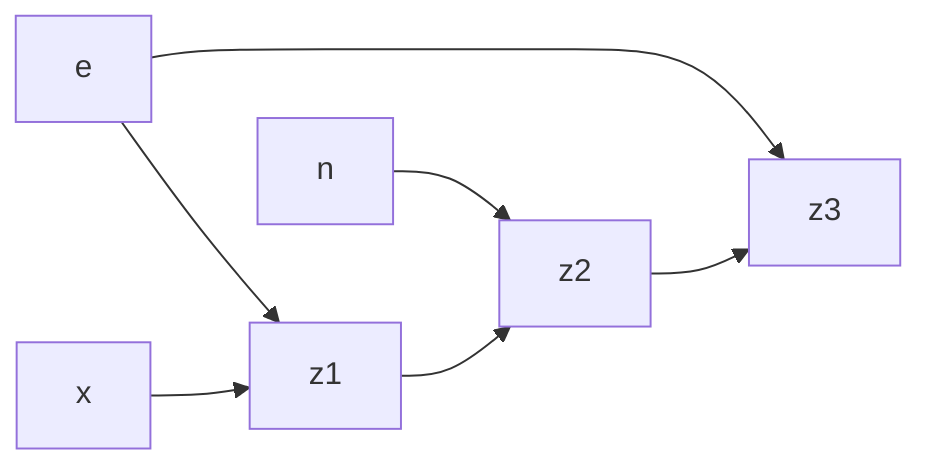
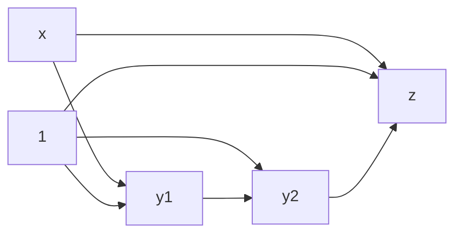
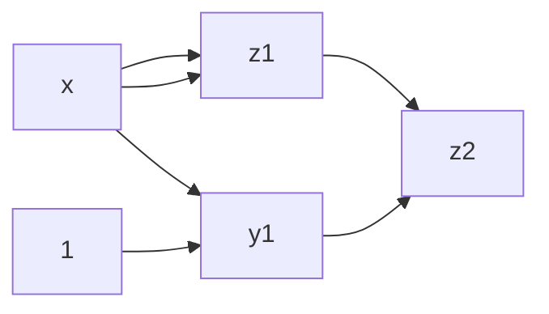

$f(x)=\frac{x-1}{x}=1-\frac{1}{x}$

%%$ψ(\tilde{x})=\frac{(x(1+ϵ_x)-1)(1+ϵ_1)}{x(1+ϵ_x)}(1+ϵ_2)=(1+ϵ_1-\frac{1+ϵ_1}{x(1+ϵ_x)})(1+ϵ_2)=1+ϵ_1-\frac{1+ϵ_1}{x(1+ϵ_x)}+ϵ_2-\frac{ϵ_2}{x(1+ϵ_x)}$
$ϵ_{tot}=(1+ϵ_1-\frac{1+ϵ_1}{x(1+ϵ_x)}+ϵ_2-\frac{ϵ_2}{x(1+ϵ_x)}-1+\frac{1}{x})\frac{x}{x-1}=\frac{(ϵ_1+ϵ_2)x+1}{x-1}-\frac{1+ϵ_1+ϵ_2}{(x-1)(1+ϵ_x)}$
TODO%%
$ϵ_{tot}=ϵ_2+(ϵ_1+\frac{x}{x-1}ϵ_x)-ϵ_x=ϵ_2+ϵ_1+(\frac{x}{x-1}-1)ϵ_x=ϵ_2+ϵ_1+\frac{1}{x-1}ϵ_x$
$ϵ_{alg}=ϵ_2+ϵ_1$

$ϵ_{tot}=ϵ_2+\frac{\frac{1}{x}}{\frac{1}{x}-1}(ϵ_1-ϵ_x)=ϵ_2+\frac{1}{1-x}ϵ_1+\frac{1}{x-1}ϵ_x$
$ϵ_{alg}=ϵ_2+\frac{1}{1-x}ϵ_1$

---
$f(x)=x^n=e^{n·\log x}$
Assumo che $n$ non abbia problemi di rappresentazione.

$ϵ_{tot}=ϵ_1+nϵ_x$
L'algoritmo è stabile.

$ϵ_{tot}=ϵ_3+c_1ϵ_e+(n·\log x)(ϵ_2+(ϵ_1+\frac{1}{\log x}ϵ_x+c_2ϵ_e))=ϵ_3+(c_1+(n·\log x)c_2)ϵ_e+(n·\log x)ϵ_2+(n·\log x)ϵ_1+nϵ_x$
Dove:
- $c_2=\frac{e\frac{d}{de}\log x}{\log x}$ (qualcuno sa fare questa derivata?)
- $c_1=\frac{e\frac{d}{de}e^{n·\log x}}{e^{n·\log x}}$

L'algoritmo è instabile per $x$ piccolo.

---

$f(x)=x-1+\frac{1}{x+1}$

$ϵ_{tot}=ϵ_1+ϵ_2+\frac{xϵ_x+\frac{1}{x+1}ϵ_{\frac{1}{x+1}}}{\frac{x^2}{x+1}}=ϵ_1+ϵ_2+(xϵ_x+\frac{1}{x+1}(ϵ_3-ϵ_{x+1}))\frac{x+1}{x^2}={\frac{x^2}{x+1}}=ϵ_1+ϵ_2+(xϵ_x+\frac{1}{x+1}(ϵ_3-ϵ_4-\frac{x}{x+1}ϵ_x))\frac{x+1}{x^2}={\frac{x^2}{x+1}}=ϵ_1+ϵ_2+\frac{1}{x^2}ϵ_3-\frac{1}{x^2}ϵ_4+(\frac{x+1}{x}-\frac{1}{x(x+1)})ϵ_x=ϵ_1+ϵ_2+\frac{1}{x^2}ϵ_3-\frac{1}{x^2}ϵ_4+\frac{x+2}{x+1}ϵ_x$
Il problema è mal condizionato con $x$ vicino a $-1$.
È algebricamente instabile anche con $x$ vicino a $0$.

$f(x)=\frac{x^2}{x+1}$

$ϵ_{tot}=ϵ_1+ϵ_{tot_{x^2}}-ϵ_{tot_{x+1}}=ϵ_1+(ϵ_2+2ϵ_x)-(ϵ_3+\frac{x}{x+1}ϵ_x)=ϵ_1+ϵ_2-ϵ_3+\frac{x+2}{x+1}ϵ_x$
È algebricamente stabile, l'unica cosa peggiore è un basso rischio di overflow per via di $x^2$.