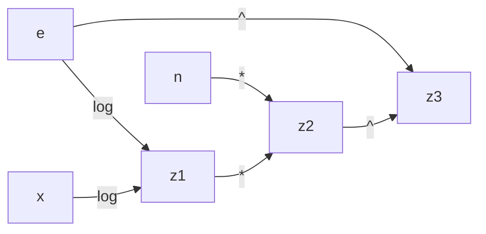

$f(x)=\frac{x-1}{x}=1-\frac{1}{x}$

%%$ψ(\tilde{x})=\frac{(x(1+ϵ_x)-1)(1+ϵ^{(1)})}{x(1+ϵ_x)}(1+ϵ^{(2)})=(1+ϵ^{(1)}-\frac{1+ϵ^{(1)}}{x(1+ϵ_x)})(1+ϵ^{(2)})=1+ϵ^{(1)}-\frac{1+ϵ^{(1)}}{x(1+ϵ_x)}+ϵ^{(2)}-\frac{ϵ^{(2)}}{x(1+ϵ_x)}$
$ϵ_{tot}=(1+ϵ^{(1)}-\frac{1+ϵ^{(1)}}{x(1+ϵ_x)}+ϵ^{(2)}-\frac{ϵ^{(2)}}{x(1+ϵ_x)}-1+\frac{1}{x})\frac{x}{x-1}=\frac{(ϵ^{(1)}+ϵ^{(2)})x+1}{x-1}-\frac{1+ϵ^{(1)}+ϵ^{(2)}}{(x-1)(1+ϵ_x)}$
TODO%%
$ϵ_{tot}≐ϵ^{(2)}+(ϵ^{(1)}+\frac{x}{x-1}ϵ_x)-ϵ_x=ϵ^{(2)}+ϵ^{(1)}+(\frac{x}{x-1}-1)ϵ_x=ϵ^{(2)}+ϵ^{(1)}+\frac{1}{x-1}ϵ_x$
$ϵ_{alg}≐ϵ^{(2)}+ϵ^{(1)}$

$ϵ_{tot}=ϵ^{(2)}+\frac{\frac{1}{x}}{\frac{1}{x}-1}(ϵ^{(1)}-ϵ_x)=ϵ^{(2)}+\frac{1}{1-x}ϵ^{(1)}+\frac{1}{x-1}ϵ_x$
$ϵ_{alg}=ϵ^{(2)}+\frac{1}{1-x}ϵ^{(1)}$

---
$f(x)=x^n=e^{n·\log x}$
Assumo che $n$ non abbia errori di rappresentazione.

$ϵ_{tot}=ϵ^{(1)}+nϵ_x$
L'algoritmo è stabile.

$ϵ_{tot}=ϵ^{(3)}+c_1ϵ_e+(n·\log x)(ϵ^{(2)}+(ϵ^{(1)}+\frac{1}{\log x}ϵ_x+c_2ϵ_e))=ϵ^{(3)}+(c_1+(n·\log x)c_2)ϵ_e+(n·\log x)ϵ^{(2)}+(n·\log x)ϵ^{(1)}+nϵ_x$
Dove:
- $c_2=\frac{e\frac{d}{de}\log x}{\log x}$ (qualcuno sa fare questa derivata?)
- $c_1=\frac{e\frac{d}{de}e^{n·\log x}}{e^{n·\log x}}$

L'algoritmo è instabile per $x$ piccolo.

---

$f(x)=x-1+\frac{1}{x+1}$

$ϵ_{tot}=ϵ^{(1)}+ϵ^{(2)}+\frac{xϵ_x+\frac{1}{x+1}ϵ_{\frac{1}{x+1}}}{\frac{x^2}{x+1}}=ϵ^{(1)}+ϵ^{(2)}+(xϵ_x+\frac{1}{x+1}(ϵ^{(3)}-ϵ_{x+1}))\frac{x+1}{x^2}={\frac{x^2}{x+1}}=ϵ^{(1)}+ϵ^{(2)}+(xϵ_x+\frac{1}{x+1}(ϵ^{(3)}-ϵ_4-\frac{x}{x+1}ϵ_x))\frac{x+1}{x^2}={\frac{x^2}{x+1}}=ϵ^{(1)}+ϵ^{(2)}+\frac{1}{x^2}ϵ^{(3)}-\frac{1}{x^2}ϵ_4+(\frac{x+1}{x}-\frac{1}{x(x+1)})ϵ_x=ϵ^{(1)}+ϵ^{(2)}+\frac{1}{x^2}ϵ^{(3)}-\frac{1}{x^2}ϵ_4+\frac{x+2}{x+1}ϵ_x$
$ϵ_{tot}=ϵ^{(3)}+c^{(3)}_1ϵ_x+c^{(3)}_3ϵ^{(2)}_{tot}=$
$c_1=\frac{x}{x-1+\frac{1}{x+1}}=\frac{x+1}{x}$
$c_3=\frac{\frac{1}{x+1}}{x-1+\frac{1}{x+1}}=\frac{1}{x^2}$
$ϵ^{(2)}_{tot}=ϵ^{(2)}-ϵ^{(1)}_{tot}$
$ϵ^{(1)}_{tot}=ϵ^{(1)}+

Il problema è mal condizionato con $x$ vicino a $-1$.
È algebricamente instabile anche con $x$ vicino a $0$.

$f(x)=\frac{x^2}{x+1}$

$ϵ_{tot}=ϵ^{(1)}+ϵ_{tot_{x^2}}-ϵ_{tot_{x+1}}=ϵ^{(1)}+(ϵ^{(2)}+2ϵ_x)-(ϵ^{(3)}+\frac{x}{x+1}ϵ_x)=ϵ^{(1)}+ϵ^{(2)}-ϵ^{(3)}+\frac{x+2}{x+1}ϵ_x$
È algebricamente stabile, l'unica cosa peggiore è un basso rischio di overflow per via di $x^2$.
