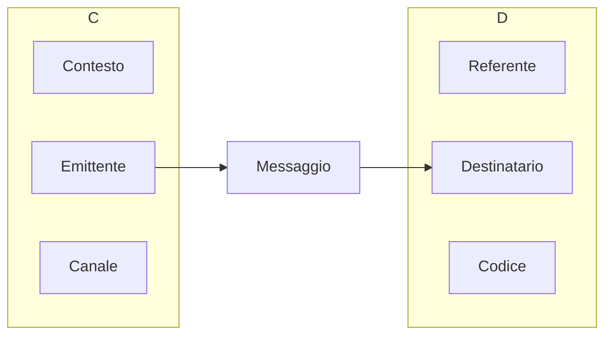

### Comunicazione verbale

> Parlare in pubblico è una forma di espressione personale e ciò che qualifica chi lo fa non è tanto il fatto di parlare, quanto l'**argomento** cui parla.
\- Scott Berkun

**Cosa fare prima di parlare**:
- Preparare accuratamente l'intervento
- Un'ottima presentazione nasce da un solido lavoro di riflessione sui contenuti
- L'obiettivo non deve essere la perfezione, ma acquisire fiducia.
- Raggiungere la sede in tempo
- Provare le apparecchiature e il discorso
- Mangiare in anticipo
- Parlare con qualcuno del pubblico per ridurre distanze

**Semplicità**:
- Riuscire a spiegare concetti difficili in modo semplice
- Puntare alla chiarezza e alla precisione
- Esporre l'argomento a una persona che non ne sa niente

**Gestione del tempo**:
- Fare il numero slide appropriate (e.g. mediamente una slide per minuto)
- Allenarsi a casa, monitorando il tempo.

#### Modello di Jakobson

### Comunicazione non verbale

- Tono di voce
- Tieni la giusta distanza dal microfono

Ritmo:
- Non troppo veloce, non troppo lento
- Fare le pause giuste
- Non "comprimere" i discorsi quando manca poco tempo

Abbigliamento

### Come fare le slide

- Font
- Colori (contrasto)
- Se possibile, evita testo e comunica graficamente

### Esempi di presentazioni

Testi di laurea
- *4 minuti* indice
- *6 minuti* descrizione ricerca e illustrazione lavoro
- *5 minuti* Conclusioni e riassunto

Elevator pitch, 5 slide in 5 minuti:
- Presentati
- Spiega il problema
- Spiega la soluzione
- Condividi la tua proposta di valore (cioè, è superiore rispetto a quello che c'è sul mercato)
- Aggiungi un invito all'azione (ho bisogno di soldi, lavoratori...)