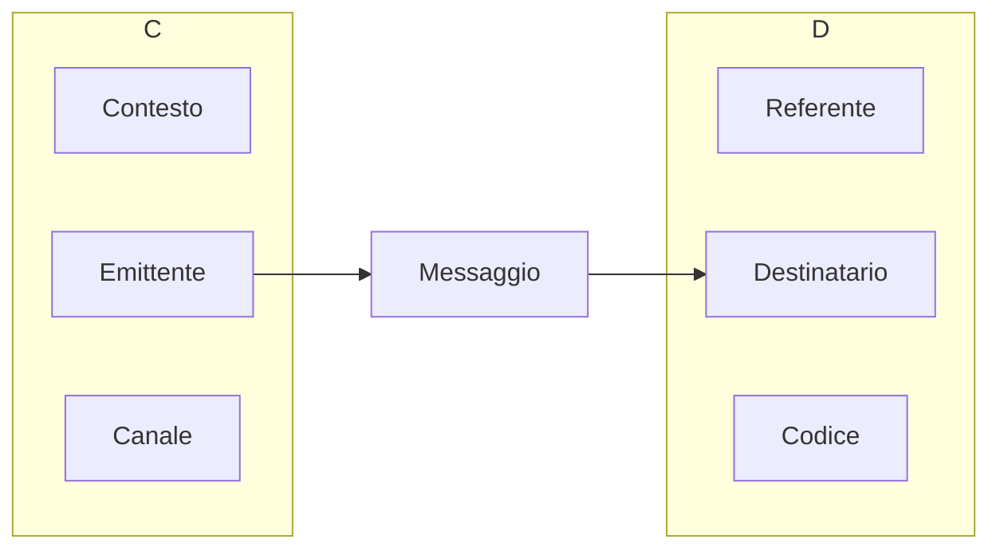

> Parlare in pubblico è una forma di espressione personale e ciò che qualifica chi lo fa non è tanto il fatto di parlare, quanto l'**argomento** cui parla.
\- Scott Berkun

**Cosa fare prima di parlare**:
- Preparare accuratamente l'intervento
- Un'ottima presentazione nasce da un solido lavoro di riflessione sui contenuti
- L'obiettivo non deve essere la perfezione, ma acquisire fiducia.
- Raggiungere la sede in tempo
- Provare le apparecchiature e il discorso
- Mangiare in anticipo
- Parlare con qualcuno del pubblico per ridurre distanze

**Semplicità**:
- Riuscire a spiegare concetti difficili in modo semplice
- Puntare alla chiarezza e alla precisione
- Esporre l'argomento a una persona che non ne sa niente

**Gestione del tempo**:
- Fare il numero slide appropriate (e.g. mediamente una slide per minuto)
- Allenarsi a casa, monitorando il tempo.
#### Modello di Jakobson

### Comunicazione verbale e non verbale

### Come fare le slide

### Esempi di presentazioni
