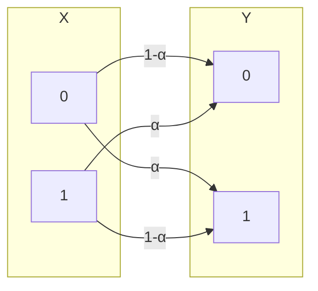

Idealmente, un canale senza rumore prende un simbolo in ingresso e fa uscire lo stesso simbolo.

Nella realtà, il rumore può alterare i simboli durante la trasmissione: da un simbolo $x_i$ dell'alfabeto $X$ esce un simbolo $y_j$ dell'alfabeto $Y$.

È necessaria quindi una *codifica di canale*, per minimizzare l'impatto del rumore.

In un *canale discreto senza memoria tempo-invariante*, la probabilità che un $x_i$ diventi un $y_j$ in uscita è nota per ogni $i$ e $j$. Si può quindi rappresentare le varie probabilità in una matrice.

### Entropia congiunta

Date due sorgenti, $X$ e $Y$, con $k$ e $h$ possibili uscite rispettivamente:
$H(X,Y)=-∑\limits_{i=1}^k∑\limits_{j=1}^hp(x_i,y_j)\log p(x_i,y_j)≤H(X)+H(Y)$
Con uguaglianza se sono indipendenti.

La disuguaglianza è dovuta dal [[Informazione#^aae359|lemma del logaritmo]]:
- $H(X)=-∑\limits_{i=1}^kp(x_i)\log p(x_i)=-∑\limits_{i=1}^k(∑\limits_{j=1}^hp(x_i,y_j))\log p(x_i)$
- $H(Y)=-∑\limits_{j=1}^hp(y_j)\log p(y_j)=-∑\limits_{j=1}^h(∑\limits_{i=1}^kp(x_i,y_j))\log p(y_j)$
- $H(X)+H(Y)=-∑\limits_{i=1}^k∑\limits_{j=1}^hp(x_i,y_j)(\log p(x_i)+\log p(y_j))=-∑\limits_{i=1}^k∑\limits_{j=1}^hp(x_i,y_j)\log (p(x_i)p(y_j))$

Quindi, c'è uguaglianza se e solo se $X$ e $Y$ sono indipendenti.

### Entropia condizionata

^48225d

$H(X|Y)=-∑\limits_{j=1}^hp(y_j)H(X|Y=y_j)=-∑\limits_{i=1}^k∑\limits_{j=1}^hp(x_i,y_j)\log(p(x_i|y_j))$
- $H(X,Y)=H(X)+H(Y|X)$
- $H(X,Y)=H(Y)+H(X|Y)$
- $H(X|Y)≤H(X)$
	- Sono uguali se e solo se $X$ e $Y$ sono indipendenti.

### Informazione mutua

^dd30fc

$I(X;Y)=H(X)-H(X|Y)=H(Y)-H(Y|X)=∑\limits_{i=1}^k∑\limits_{j=1}^hp(x_i,y_j)\log\frac{p(x_i,y_j)}{p(x_i)p(y_j)}≥0$

Si definisce *capacità del canale*:
$C_S=\max\limits_{p(x_i)}\{I(X;Y)\}\text{ [bit/simbolo]}$

In un canale capace di trasmettere $s$ simboli al secondo, la *capacità per unità di tempo* è:
$C=s·C_S\text{ [bit/secondo]}$

Nel cercare di creare una codifica di canale che minimizzi l'impatto del rumore, si vuole massimizzare la capacità del canale:
- Un canale senza rumore ideale ha capacità $\max\limits_{p(x_i)}H(X)=\log m$.
	- Un *canale lossless* ha una relazione da $X$ a $Y$ iniettiva (può essere uno-a-molti). $P(x_i|y_j)=1$ se $P(y_j|x_i)>0$, e $P(x_i|y_j)=0$ altrimenti.
- Un canale con un rumore tale da essere inutile ha capacità $0$ ($X$ e $Y$ sono indipendenti).

#### Canale simmetrico

Un canale con due simboli di sorgente e destinazione.
Per la sorgente, le probabilità dei due simboli sono $p$ e $1-p$.
Nel canale, il rumore ha probabilità $α$ di cambiare il simbolo in uscita.

Definendo $Ω(p)=-p\log p-(1-p)\log(1-p)$ l'entropia di una sorgente binaria:
- $H(Y)=Ω(p(1-α)+(1-p)α)=Ω(p+α-2pα)$
- $H(Y|X)=Ω(α)$
- $I(X;Y)=Ω(p+α-2pα)-Ω(α)$
	- L'informazione muta massima si ha con $p=0.5$, quindi $C_S=1-Ω(α)$.
